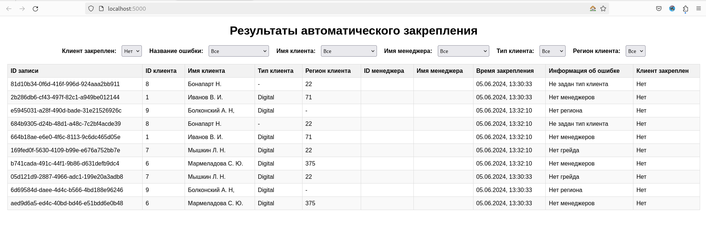

# Автоматическое закрепление SmartMatch
_ref: [Техническое задание](https://docs.google.com/document/d/1Oc6vNmB1S7iFU8d62P16DfhGp1Ja9PEedhL3NxFU2p8/edit)_

<!-- TOC -->
* [Автоматическое закрепление SmartMatch](#автоматическое-закрепление-smartmatch)
* [Общее](#общее)
* [Дашборд](#дашборд)
* [Запуск](#запуск)
  * [I. Через docker compose](#i-через-docker-compose)
  * [II. Через клонирование](#ii-через-клонирование)
* [Полезные ссылки](#полезные-ссылки)
<!-- TOC -->

# Общее
Процесс автозакрепления запускается ежедневно в 21:00.

Также процесс можно запустить вручную, отправив `GET` запрос по адресу `/autoassign/start`.

Чтобы менеджер получил письмо, необходимо, чтобы его email был в списке разрешенных, в поле `app.email.whitelist` файла `application.properties`. Там же необходимо указать пароль от почтового ящика, выполняющего рассылку.

Все интеграции со внешними системами реализованы с помощью файлов-заглушек.

Обработка клиентов выполняется параллельно.

# Дашборд

В папке [frontend](frontend) лежит скрипт для визуализации данных. Он получает данные по ендпоинту `/autoassign` методом `GET`. 



# Запуск

Есть 2 способа запуска. Лучше использовать docker, так как он требует минимальной настройки компонентов, они все связаны в `docker-compose.yaml`.

## I. Через docker compose
 1. Скачать и установить Docker Desktop (инструкция - [тык](https://docs.docker.com/desktop/install/windows-install/))
2. Создать на пк тестовую папку, в неё поместить файл `docker-compose.yaml` (скачать из репозитория) + создать папку, где будут лежать файлы-заглушки (`dwh_clients.csv`, `mdm_managers.csv`, `sap_managers.csv`, их можно скачать из репозитория `src/main/resources/`)
3. Поправить docker-compose.yaml:

&emsp;&emsp;3.1. Изменить свойство `volumes`:
```yaml
volumes:
    - /путь/до/папки/c/заглушками:/app/external-system-data #для linux/mac
    
    - C:\\путь\\до\\папки\\с\\заглушками:/app/external-system-data #для windows
```
&emsp;&emsp;3.2. В свойстве APP_EMAIL_PASSWORD указать актуальный пароль (спросить у меня)

```yaml
    - APP_EMAIL_PASSWORD=secretpass
```

&emsp;&emsp;3.3. В свойстве APP_EMAIL_WHITE_LIST можно добавить почтовые ящики, которым разрешено отправлять письма.

4. Запустить контейнер

&emsp;&emsp;4.1. Открыть терминал/командную строку в папке с `docker-compose.yaml`

&emsp;&emsp;4.2. Выполнить команду
```shell
docker compose up
```
&emsp;&emsp;4.3. Дождаться пока все скачается, запуститься, инициализируется...
Финальной строкой должно быть что-то вроде:
```shell
smartmatch  | ... : Completed initialization in 2ms
```
5. Запустить сам процесс - перейти в браузере по ссылке http://localhost:8080/autoassign/start. Если вывелось "AutoAssignProcess finished", то все ок.

## II. Через клонирование
1. Клонировать проект
2. Настроить файл `application.properties` на БД, установить APP_EMAIL_PASSWORD, APP_EMAIL_WHITE_LIST
3. Вручную запустить приложение
4. Запустить дашборд (см. [инструкцию](frontend/README.md))

# Полезные ссылки
- http://localhost:8080/autoassign - получить JSON со всеми закреплениями из локальной БД.
- http://localhost:8080/autoassign/clear - очистить локальную БД с результатами закреплений.
- http://localhost:8080/autoassign/start - запустить процесс, если не хотитеждать 21:00.
- http://localhost:5000 - дашборд с результатами